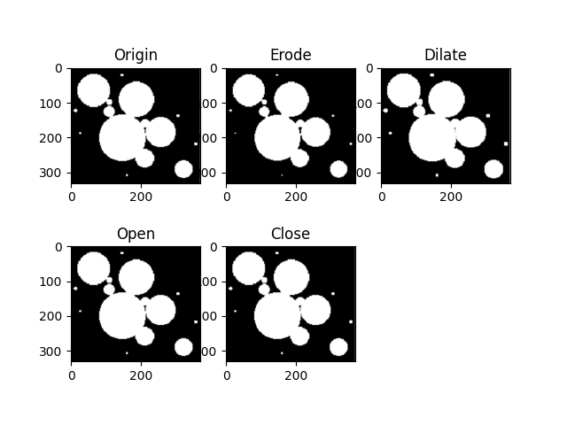
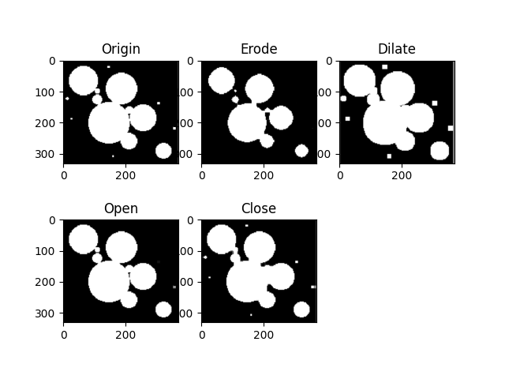

# 腐蚀、膨胀、开运算、闭运算
开运算：先腐蚀，后膨胀  
闭运算：先膨胀，后腐蚀

### 任务
分别取不同大小的算子，分别对图像进行腐蚀、膨胀、开运算和闭运算操作。可以发现，腐蚀操作使图像的轮廓缩小，并且随着算子大小的增大，缩小的越明显。膨胀操作，使图像轮廓扩大，并且随着算子大小的增大，扩大的越明显。开运算，可以去除图像中的噪点。闭运算，可以处理图像中的小黑点。  
**算子大小为3的图像**：  
  
**算子大小为5的图像**:  
  
**算子大小为7的图像**:  
  
**算子大小为9的图像**:  
  
