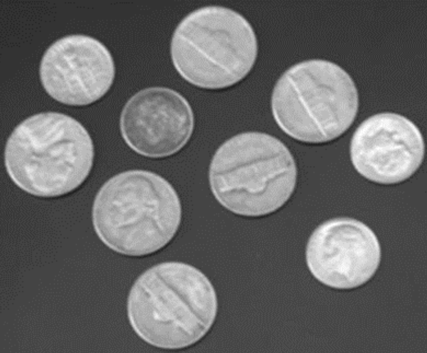
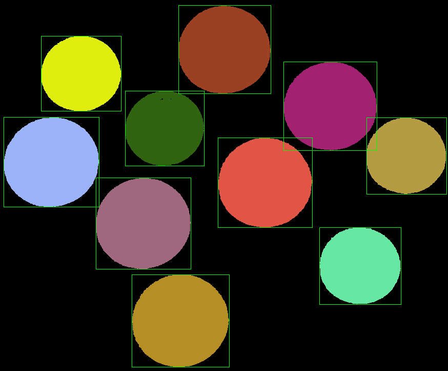

# 连通域
**cv2.connectedComponents()**:  
```python
'''
参数：
    img: 输入图像
返回值：
    num: 连通域的数量
    labels：每一像素的标记，用数字0、1、2...表示（不同的数字表示不同的连通域）
'''
num, labels = cv2.connectedComponents(img)
```  
**cv2.connectedComponentsWithStats()**:
```python
'''
参数：
    img: 输入图像
    connectivity: 使用4连通还是8连通, 可选值为4和8
    ltype: 输出图像标记的类型
返回值：
    num: 连通域的数量
    labels: 每一像素的标记，用数字0、1、2...表示（不同的数字表示不同的连通域）
    stats: 一个5列的二阶矩阵，每一行对应每个连通区域的外接矩形的x、y、width、height和面积
    centroids: 每个连通域的中心点
'''
num, labels, stats, centroids = cv2.connectedComponentsWithStats(img, connectivity=8, ltype=None)
```  
### 任务
具体过程见代码注释
**输入**：  
  
**输出**：  
  
