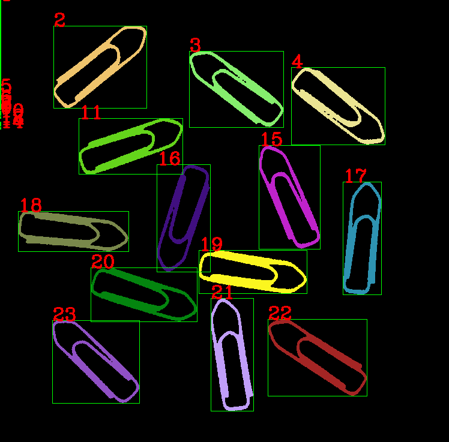
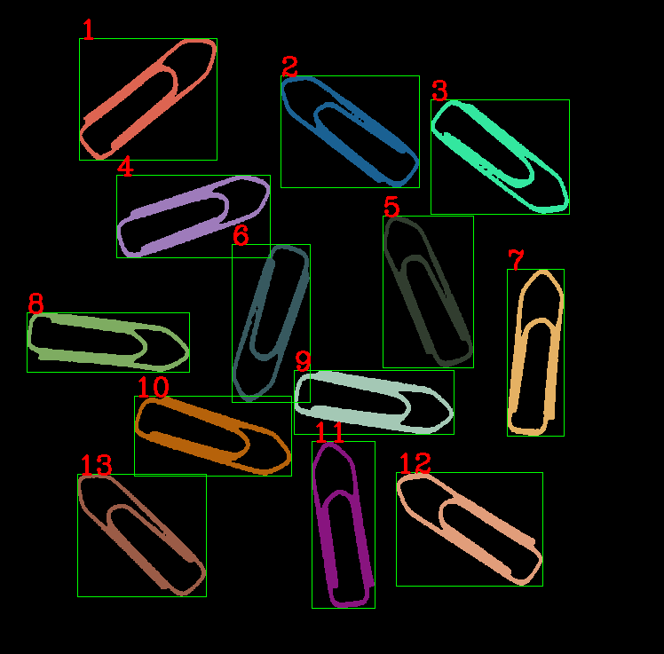

# task11
本任务与上个任务差不多，代码直接复制粘贴，并稍微修改。本以为就解决了但是，输出结果却大失所望。  
**结果1**：  
  
图像的左侧有好几个连通域。  
  
如何解决这个问题呢:question:  
我尝试通过开运算，消除左侧的小连通域，但是并不能完全消除，如果增大算子大小，会导致曲别针的连通域断开。最后通过减小二值化的阈值，以及使用开运算操作，消除了左侧连通域。但总觉得还有更好的操作方法。  
**最终效果**：  
  
