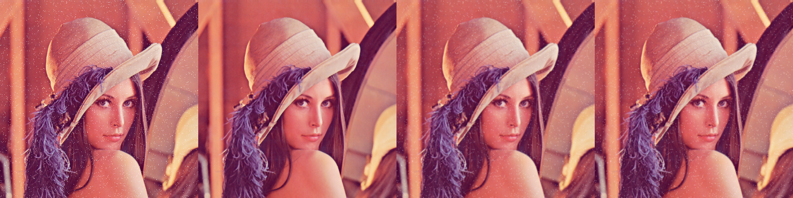

# 滤波
**中值滤波**：  
创建一个kernel，用这个kernel遍历整个图像，像素值为kernel中所有像素的中位数。  
中值滤波对处理噪点效果很好，毕竟是取中位数，噪点很难排到中间。   
```python
# 第二个参数为kernel大小
img_median = cv2.medianBlur(img, 3)
```
**均值滤波**：  
kernel中的每一格对图像的权重是一样的，像素值为kernel中像素和的平均值。   
```python
# 第二个参数为kernel大小
img_blur = cv2.blur(img, (3, 3))
```
**高斯滤波**：  
kernel中的每一格权重不同，越中心权重越大，像素值为每一格像素值*对应权重的和。  
```python
# 第二个参数为kernel大小，第三个参数为水平方向的标准差
img_gaussian = cv2.GaussianBlur(img, (3, 3), 1)
```  
### 任务
任务本来是要处理摄像头图像的，但由于我的笔记本摄像头无法被系统识别，就只对一张图像进行处理。  
**输出结果**：   
  
从左到右：原图、中值滤波、均值滤波、高斯滤波  
