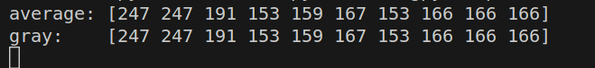

# task_1
### 输出结果
#### 原图

#### 输出图像

这个输出图像不就是灰度图
#### 验证
调用opencv自带的函数把图像转化为灰度图
```
img_gray = cv2.cvtColor(img, cv2.COLOR_BGR2GRAY)
print('average:',img[0,:10,0])
print('gray:   ',img_gray[0,:10])
```
##### 输出
  
灰度图的像素值可以是RGB三通道像素值的平均值。