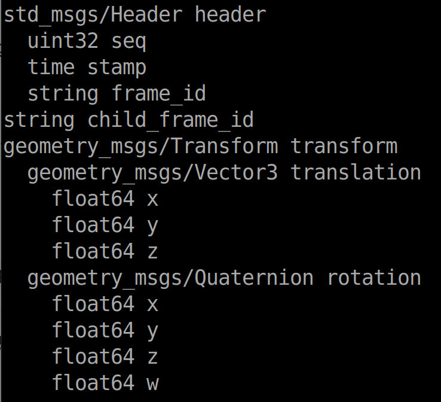
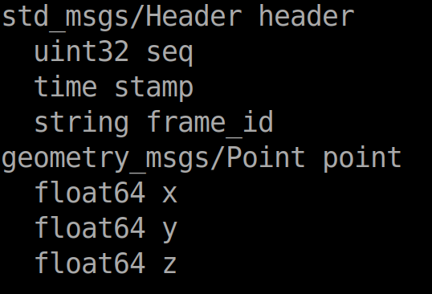

# ROS
## 1 ROS项目一般流程
#### 1.1 创建工作空间
```shell
mkdir -p workspace/src
cd ./workspace
catkin_make    # 初始化
```
#### 1.2 创建ros包并添加依赖
```shell
cd ./src
catkin_create_pkg ros_bag roscpp rospy std_msgs    # ros_bag:自定义ros包名 roscpp,rospy,std_msgs:依赖项
```
#### 1.3 编辑源文件
##### C++
```shell
cd ./ros_bag
vim xxx.cpp
```
```cpp
#include "ros/ros.h"

int main(int argc, char *argv[])
{
    // 节点初始化
    ros::init(argc, argv, "hello");
    // 创建句柄
    ros::NodeHandle nh;
    // 控制台输出日志
    ROS_INFO("hello world!");

    return 0;
}
```
##### Python
```shell
cd ./ros_bag
mkdir scripts
cd ./scripts
vim xxx.py
```
```python
#! /usr/bin/env python

import rospy

if __name__ == "__main__":
    # 节点初始化
    rospy.init_node("hello")
    # 输出日志
    rospy.loginfo("hello world!")
```
ps：记得给python文件添加可执行权限
```shell
chmod +x *.py
```
#### 1.4 编辑ros_bag的CMakeLists.txt文件
##### C++
```typescript
add_executable(源文件名 src/源文件名.cpp)

target_link_libraries(源文件名
    ${catkin_LIBRARIES}
)
```
##### Python
```typescript
catkin_install_python(PROGRAMS
    scripts/源文件名.py
    DESTINATION ${CATKIN_PACKAGE_BIN_DESTINATION}
)
```
#### 1.5 编译
```shell
cd workspace
catkin_make
```
#### 1.6 执行
命令行1
```shell
roscore
```
命令行2
```shell
cd workspace
source ./devel/setup.bash
rosrun ros_bag 源文件名       # 执行c++文件
rosrun ros_bag 源文件名.py    # 执行python文件
```
## 2 ROS通信机制
### 2.1 话题通信
#### 2.1.1 自定义msg
##### 创建msg文件
```shell
cd ros_bag
mkdir msg
cd msg
vim xxx.msg
```
xxx.msg:
```txt
string xxx1
uint16 xxx2
float64  xxx3
...
```
##### 编辑package.xml文件
```xml
<build_depend>message_generation</build_depend>
<exec_depend>message_runtime</exec_depend>
```
##### 编辑CMakeLists.txt
```typescript
find_package(catkin REQUIRED COMPONENTS
  roscpp
  rospy
  std_msgs
  message_generation    #新添加的
)

add_message_files(
  FILES
  xxx.msg    # 新添加的
)

# 生成消息时依赖于 std_msgs
generate_messages(
  DEPENDENCIES
  std_msgs
)

#执行时依赖
catkin_package(
#  INCLUDE_DIRS include
#  LIBRARIES demo02_talker_listener
  CATKIN_DEPENDS roscpp rospy std_msgs message_runtime    # 添加message_runtime
#  DEPENDS system_lib
)

```
#### 2.1.2 源文件模板（C++）
##### 发布方
```cpp
#include "ros/ros.h"
#include "std_msgs/String.h"
// #include "ros_bag/xxx.h"    // xxx:自定msg的文件名

int main(int argc, char *argv[])
{
    // 设置编码
    setlocale(LC_ALL, "");

    // 初始化节点
    ros::init(argc, argv, "talker");

    // 创建句柄
    ros::NodeHandle nh;

    // 创建发布者对象
    ros::Publisher pub = nh.advertise<std_msgs::String>("chatter",10);
    // ros::Publisher pub = nh.advertise<ros_bag::xxx>("chatter",10);

    // 定义数据
    std_msgs::String msg;
    msg.data = "hello";
    // ros_bag::xxx msg;
    // msg.xxx1 = "hello";
    // msg.xxx2 = 100;
    // ...

    // 设置循环频率
    ros::Rate rate(1)    //一秒一次

    while (ros::ok())
    {
        // 发布消息
        pub.publish(msg);

        // 打印发送的消息
        ROS_INFO("msg:%s", msg.data.c_str());
        // ROS_INFO("msg:%s,%d", msg.xxx1.c_str(), msg.xxx2);

        // 休眠
        rate.sleep();
        
        // 官方建议
        ros::spinOnce();
    }
    return 0;
}
// 可自行添加计数器等
// 注释的语句为自定义msg的模板
```
##### 订阅方
```cpp
#include "ros/ros.h"
#include "std_msgs/String.h"

// 回调函数
void doMsg(const std_msgs::String::ConstPtr& msg){
    ROS_INFO("msg:%s", msg->data.c_str());
}

int main(int argc, char *argv[])
{
    // 设置编码
    setlocale(LC_ALL, "");

    // 初始化节点
    ros::init(argc, argv, "listener");

    // 创建句柄
    ros::NodeHandle nh;

    // 创建订阅者对象
    ros::Subscriber sub = nh.subscribe<std_msgs::String>("chatter", 10, doMsg);
    
    // 循环调用回调函数
    ros::spin();

    return 0；
}
// 订阅方的自定义msg实现改的地方与发布方类似
```
#### 2.1.3 源文件模板（Python）
##### 发布方
```python
#! /usr/bin/env python

import rospy
from std_msgs.msg import String
# from ros_bag.msg import xxx

if __name__ == "__main__":
    #  初始化节点
    rospy.init_node("talker_p")

    # 创建发布者对象
    pub = rospy.Publisher("chatter", String, queue_size=10)

    # 定义数据
    msg = String()
    msg.data = "hello"
    # msg = xxx()
    # msg.xxx1 = "hello"
    # msg.xxx2 = 100

    # 设置循环频率
    rate = rospy.Rate(1)

    while not rospy.is_shutdown():
        # 发布消息
        pub.publish(msg)

        # 打印发送的消息
        rospy.loginfo("msg:%s", msg.data)
        # rospy.loginfo("msg:%s,%d", msg.xxx1, msg.xxx2)

        # 休眠
        rate.sleep()

# 可自行添加计数器等
# 注释的语句为自定义msg的模板
```
##### 订阅方
```python
#! /usr/bin/env python

import rospy
from std_msgs.msg import String

# 回调函数
def doMsg(msg):
    rospy.loginfo("msg:%s", msg.data)

if __name__ = "__main__":
    # 初始化节点
    rospy.init_node("listener_p")
    # 创建订阅者对象
    sub = rospy.Subscriber("chatter", String, doMsg, queue_size=10)
    # 循环调用回调函数
    rospy.spin()

# 订阅方的自定义msg实现改的地方与发布方类似
```
### 2.2服务通信
#### 2.2.1自定义srv
##### 创建srv文件
```shell
cd ros_bag
mkdir srv
cd srv
vim xxx.srv
```
srv文件：
```txt
# request
int32 num1
int32 num2
---     # 请求和响应的分割线
# response
int32 sum
```
##### 编辑package.xml
```xml
<build_depend>message_generation</build_depend>
<exec_depend>message_runtime</exec_depend>
```
##### 编辑CMakeLists.txt
```typescript
find_package(catkin REQUIRED COMPONENTS
  roscpp
  rospy
  std_msgs
  message_generation    # 新添加的
)

add_service_files(
  FILES
  xxx.srv    # 新添加的
)

# 解锁
generate_messages(
  DEPENDENCIES
  std_msgs
)

```
#### 2.2.2 源文件模板（C++）
##### 服务端
```cpp
#include "ros/ros.h"
#include "ros_bag/xxx.h"

// 回调函数，bool返回值为是否处理成功
bool deReq(ros_bag::xxx::Request& req,ros_bag::xxx::Response& resp){
    int num1 = req.num1;
    int num2 = req.num2;
    if (输入有误){
        return false;    
    }
    resp.sum = num1 + num2;
    return true
}

int main(int argc, char *argv[])
{
    setlocale(LC_ALL, "");
    // 初始化节点
    ros::init(argc, argv, "server");
    // 创建句柄
    ros::NodeHandle nh;
    // 创建服务对象
    ros::ServiceServer server = nh.advertiseService("chatter", doReq);
    // 循环调用回调函数
    ros::spin();
    return 0;
}
```
##### 客户端
```cpp
#include "ros/ros.h"
#include "ros_bag/xxx.h"

int main(int argc, char *argv[])
{
    setlocale(LC_ALL, "");
    
    // 检查输入是否错误
    if (argc != 3){
        ROS_ERROR("输入错误");
        return 1;
    }

    // 初始化节点
    ros::init(argc, argv, "client");

    //创建句柄
    ros::NodeHandle nh;

    // 创建客户端对象
    ros::ServiceClient client = nh.serviceClient<ros_bag::xxx>("chatter");

    // 等待服务启动
    ros::service::waitForService("chatter");
    // client.waitForService();

    // 定义请求数据
    ros_bag::xxx add_num;
    add_num.request.num1 = atoi(argv[1]);
    add_num.request.num2 = atoi(argv[2]);

    // 发送请求，并返回bool值
    bool flag = client.call(add_num);

    // 处理响应
    if (flag){
        ROS_INFO("sum:%d", add_num.response.sum);
    }
    else{
        ROS_ERROR("err!");
        return 1;
    }
     return 0;
}
```
#### 2.2.3 源文件模板（Python）
##### 服务端
```python
#! /usr/bin/env python

import rospy
from ros_bag.srv import xxx, xxxRequest, xxxResponse

# 回调函数
def doReq(req):
    sum = req.num1 + req.num2
    resp = xxxResponse()
    resp.sum = sum
    return resp

if __name__ == "__main__":
    # 初始化节点
    rospy.init_node("server_p")
    # 创建服务端对象
    server = rospy.Service("chatter", xxx, doReq)
    # 循环调用回调函数
    rospy.spin()
```
##### 客户端
```python
#! /usr/bin/env python

import rospy
from ros_bag.srv import *
import sys

if __name__ == "__main__":
    # 判断输入是否有误
    if len(sys.argv) != 3:
        rospy.logerr("输入错误")
        sys.exit(1)

    # 初始化节点
    rospy.init_node("client_p")

    # 创建请求对象
    client = rospy.ServiceProxy("chatter", xxx)

    # 等待服务器
    rospy.wait_for_service("chatter")
    # client.wait_for_service()

    # 定义数据
    req = xxxRequest()
    req.num1 = int(sys.argv[1])
    req.num2 = int(sys.argv[2])

    # 发送请求
    resp = client.call(req)

    # 输出信息
    rospy.loginfo("sum:%d", resp.sum)
    
```
### 2.3 参数服务器
#### 2.3.1 新增（修改）参数
##### C++
```cpp
// 使用NodeHandle
ros::NodeHandle nh;
nh.setParam("nh_int", 10);
nh.setParam("nh_double", 10.0);
nh.setParam("nh_bool", true);
nh.setParam("nh_string", "hello");
nh.setParam("nh_vector", _vector);
nh.setParam("nh_map", _map);
// 修改（相同的键，不同的值）

// 使用param
ros::param::set("param_int", 10);
...

```
##### python
```python
rospy.set_param("p_int", 10)
rospy.set_param("p_double", 10.0)
rospy.set_param("p_bool", True)
rospy.set_param("p_string", "hello")
rospy.set_param("p_list", _list)
rospy.set_param("p_dict", _dict)
```
#### 2.3.2 获取参数
##### C++
```cpp
// 使用NodeHandle
ros::NodeHandle nh;
nh.param(键, 默认值);    //存在，返回对应结果，否则返回默认值
nh.getParam(键, 存储结果的变量);    // 存在，返回true
nh.getParamCached(键, 存储结果的变量);    // 与getParam类似，提高了变量获取效率
nh.getParamNames(std::vector<std::string>);    // 获取所有的键，存储在vector变量中
nh.hasParam(键);    // 是否包含键
nh.searchParam(参数1, 参数2);    // 搜索键，参数1是被搜索的键，参数2是存储结果的的变量

// 使用param
ros::param::param(键, 默认值);
ros::param::get(键, 存储结果的变量);
ros::param::getCached(键, 存储结果的变量);
ros::param::getParamNames(std::vector<std::string>);
ros::param::has(键);
ros::param::search(参数1, 参数2);
```
##### python
```python
int_value = rospy.get_param("p_int",10000)
int_cached = rospy.get_param_cached("p_int")
names = rospy.get_param_names()
flag = rospy.has_param("p_int")
key = rospy.search_param("p_int")
```
#### 2.3.3 删除参数
##### C++
```cpp
ros::NodeHandle nh;
bool flag1 = nh.deleteParam("nh_int");

bool flag2 = ros::param::del("param_int");
```
##### python
```python
rospy.delete_param("p_int")
```
### 2.4 常用命令
#### 2.4.1 rosnode
```txt
rosnode ping        # 测试节点的连接状态
rosnode list        # 列出活动节点
rosnode info        # 打印节点信息
rosnode machine     # 列出指定设备上的节点
rosnode kill        # 杀死某个节点
rosnode cleanup     # 清除不可连接的节点（死节点） 
```
#### 2.4.2 rostopic
```txt
rostopic bw         # 显示主题使用的带宽
rostopic delay      # 显示带有header的主题延迟
rostopic echo       # 打印消息到屏幕
rostopic find       # 根据类型查找主题
rostopic hz         # 显示主题的发布频率
rostopic info       # 显示主题相关信息
rostopic list       # 显示所有活动状态下的主题
rostopic pub        # 将数据发布到主题
rostopic type       # 打印主题类型
```
#### 2.4.3 rosmsg
```txt
rosmsg show         # 显示消息描述
rosmsg info         # 显示消息信息
rosmsg list         # 列出所有消息
rosmsg md5          # 显示 md5 加密后的消息
rosmsg package      # 显示某个功能包下的所有消息
rosmsg packages     # 列出包含消息的功能包
```
#### 2.4.4 rosservice
```txt
rosservice args     # 打印服务参数
rosservice call     # 使用提供的参数调用服务
rosservice find     # 按照消息类型查找服务
rosservice info     # 打印有关服务的信息 
rosservice list     # 列出所有活动的服务
rosservice type     # 打印消息的类型
rosservice uri      # 打印服务器的uri
```
#### 2.4.5 rossrv
```txt
rossrv show         # 显示服务消息详情
rossrv info         # 显示服务消息的相关信息
rossrv list         # 列出所有服务消息
rossrv md5          # 显示 md5 加密后的服务消息
rossrv package      # 显示某个包下所有服务消息
rossrv packages     # 显示包含服务消息的所有包
```
#### 2.4.6 rosparam
```txt
rosparam set        # 设置参数
rosparam get        # 获取参数
rosparam load       # 从外部文件加载参数
rosparam dump       # 将参数写出到外部文件
rosparam delete     # 删除参数
rosparam list       # 列出所有参数
```
## 3 ROS运行管理
### 3.1 launch文件
#### 3.1.1 node标签
**属性**
```xml
<node pkg="包名"
      type="节点类型"
      name="节点名称"
      args="xxx xxx xxx"        # 传参
      machine="机器名"           # 指定机器启动节点
      respawn="true | false"    # 如果节点退出，是否自动重启
      respawn_delay="n"         # 如果respawn=true，延迟n秒后启动节点
      required="true | false"   # 该节点是否必须。如果必须，节点退出，杀死整个roslaunch
      ns="xxx"                  # 在指定的命名空间启动节点
      clear_params="true | false"       # 在启动前，删掉节点的私有空间的参数
      output="log | screen"     # 日志发送目标          
/>
```
**子级标签**
- env
- remap
- rosparam
- param
#### 3.1.2 include标签
导入其他launch文件
**属性**
```xml
<include file="$(find 包名)/launch/xxx.launch" 
         ns="xxx"    #指定命名空间
/>
```
**子级标签**
- env
- arg
#### 3.1.3 remap标签
话题重命名
**属性**
```xml
<remap from="xxx"   # 原始话题
       to="yyy"     # 目标话题
/>
```
#### 3.1.4 param标签
设置参数
**属性**
```xml
<param name="xxx"   # 参数名称 
       value="xxx"  # 定义参数值
       type="str | int | double | bool | yaml"
/>
```
#### 3.1.5 rosparam标签
从yaml文件中导入导出参数
**属性**
```xml
<rosparam command="load | dump | delete"    # 加载、导出、删除参数 
          file="$(find xxx)/xxx/xxx"
          param="参数名称"
          ns="命名空间"
/>
```
#### 3.1.6 group标签
对节点分组
**属性**
```xml
<group ns="命名空间"    # 可让节点属于某个命名空间
       clear_params="true | false"      # 启动前，是否删除命名空间中的所有参数
/>
```
**子级标签**
除了launch标签，其他都可以
#### 3.1.7 arg标签
用于动态传参
**属性**
```xml
<arg name="参数名称" 
     default="默认值"
     value="数值"
     doc="描述"     # 参数说明
/>
```
**示例**
1. launch文件
    ```xml
    <launch>
        <arg name="xxx" />
        <param name="param" value="$(arg xxx)" />
    </launch>
    ```
2. 命令行动态传参
    ```shell
    roslaunch xxx.launch xxx:=值
    ```

## 4 ROS常用组件
### 4.1 TF坐标变换
#### 4.1.1 认识坐标msg
**geometry_masgs/TranformStamped**
用于传输坐标系相关位置信息  
  
**geometry_msgs/PointStamped**
用于传输某个坐标系内坐标点的消息  
  

#### 4.1.2 静态坐标发布
建议直接命令行
`rosrun tf2_ros static_transform_publisher x偏移量 y偏移量 z偏移量 z偏航角度 y俯仰角度 x翻滚角度 父级坐标系 子级坐标系`

#### 4.1.3 动态坐标变换
1. **依赖功能包**
   roscpp rospy std_msgs tf2 tf2_ros tf2_geometry_msgs geometry_msgs turtlesim  
2. **发布方**
    **c++**
    ```cpp
    #include "ros/ros.h"
    #include "turtlesim/Pose.h"
    #include "tf2_ros/transform_broadcaster.h"
    #include "geometry_msgs/TransformStamped.h"
    #include "tf2/LinearMath/Quaternion.h"

    void doPose(const turtlesim::Pose::ConstPtr& pose){
        // 创建tf广播器
        static tf2_ros::TransformBroadcaster broadcaster;

        // 创建广播数据
        geometry_msgs::TransformStamped tfs;

        // 头设置
        tfs.header.frame_id = "world";
        tfs.header.stamp = ros::Time::now();

        // 坐标系ID
        tfs.child_frame_id = "turtle1";

        // 坐标系相对位置设置
        tfs.transform.translation.x = pose->x;
        tfs.transform.translation.y = pose->y;
        tfs.transform.translation.z = 0.0;

        // 四元数设置
        tf2::Quaternion qtn;
        qtn.setRPY(0, 0, pose->theta);
        tfs.transform.rotation.x = qtn.getX();
        tfs.transform.rotation.y = qtn.getY();
        tfs.transform.rotation.z = qtn.getZ();
        tfs.transform.rotation.w = qtn.getW();

        // 广播器发布数据
        broadcaster.sendTransform(tfs);
    }

    int main(int argc, char *argv[])
    {
        setlocale(LC_ALL, "");

        // 初始化节点
        ros::init(argc, argv, "pub");

        // 创建句柄
        ros::NodeHandle nh;

        // 创建订阅对象
        ros::Subscriber sub = nh.subscribe<turtlesim::Pose>("/turtle1/pose", 1000, doPose);

        // 循环调用回调函数
        ros::spin();

        return 0;
    }
    ```

    **python**
    ```python
    import rospy
    import tf2_ros
    import tf
    from turtlesim.msg import Pose
    from geometry_msgs.msg import TransformStamped

    def doPose(pose):
        # 创建tf广播器
        broadcaster = tf2_ros.TransformBroadcaster()

        # 创建广播数据
        tfs = TransformStamped()

        # 头设置
        tfs.header.frame_id = "world"
        tfs.header.stamp = rospy.Time.now()

        # 坐标系ID
        tfs.child_frame_id = "turtle1"

        # 坐标系相对位置设置
        tfs.transform.translation.x = pose.x
        tfs.transform.translation.y = pose.y
        tfs.transform.translation.z = 0.0

        # 设置四元数
        qtn = tf.transformations.quaternion_from_euler(0, 0, pose.theta)
        tfs.transform.rotation.x = qtn[0]
        tfs.transform.rotation.y = qtn[1]
        tfs.transform.rotation.z = qtn[2]
        tfs.transform.rotation.w = qtn[3]

        # 广播器发布数据
        broadcaster.sendTransform(tfs)

 
    if __name__ == "__main__":
        # 初始化节点
        rospy.init_node("pub")
        # 订阅话题消息
        sub = rospy.Subscriber("/turtle1/pose", Pose, doPose)
        # 循环调用回调函数
        rospy.spin()
    ```

3. **订阅方**
    **c++**
    ```cpp
    #include "ros/ros.h"
    #include "tf2_ros/transform_listener.h"
    #include "tf2_ros/buffer.h"
    #include "geometry_msgs/PointStamped.h"
    #include "tf2_geometry_msgs/tf2_geometry_msgs.h"

    int main(int argc, char *argv[])
    {
        setlocale(LC_ALL, "");

        // 初始化节点
        ros::init(argc, argv, "sub");

        // 创建句柄
        ros::Nodehandle nh;

        // 创建tf订阅节点
        tf2_ros::Buffer buffer;
        tf2_ros::TransformListener listener(buffer);

        ros::Rate rate(10);

        while (ros::ok()){
            // 生成一个相对于子级坐标系的坐标点
            geometry_msgs::PointStamped point_laser;
            point_laser.header.frame_id = "turtle1";
            point_laser.header.stamp = ros::Time();
            point_laser.point.x = 1;
            point_laser.point.y = 1;
            point_laser.point.z = 0;

            // 转换成相对父级坐标系的坐标点
            try
            {
                geometry_msgs::PointStamped point_base;
                point_base = buffer.transform(point_laser, "world");
                ROS_INFO("...");   // 打印消息，偷个懒hh
            }
            catch(const std::exception& e)
            {
                ROS_INFO("出错了");
            }

            // 休眠
            rate.sleep();
            ros::spinOnce();
        }
        return 0
    }
    ```

    **python**
    ```python
    import rospy
    import tf2_ros
    from tf2_geometry_msgs import PointStamped

    if __name__ == "__main__":
        # 初始化节点
        rospy.init_node("sub")

        # 创建tf订阅对象
        buffer = tf2_ros.Buffer()
        listener = tf2_ros.TramsformListener(buffer)

        rate = rospy.Rate(10)

        while not rospy.is_shutdown():

            # 生成一个相对于子级坐标系的坐标点
            point_laser = PointStamped()
            point_laser.header.frame_id = "turtle1"
            point_laser.header.stamp = rospy.Time.now()
            point_laser.point.x = 1
            point_laser.point.y = 1
            point_laser.point.z = 0

            # 转换成相对父级坐标系的坐标点
            try:
                point_base = buffer.transform(point_laser, "world", rospy.Duration(1))
                rospy.loginfo("...")    # 打印消息
            except Exception as e:
                rospy.logerr(f"异常：{e}")

            # 休眠
            rate.sleep()
    ```

#### 4.1.4 多坐标变换
依赖的功能包与发布方的实现与动态坐标发布类似，因此不在赘述。
**订阅方**
**c++**
```cpp
#include "ros/ros.h"
#include "tf2_ros/transform_listener.h"
#include "tf2/LinearMath/Quaternion.h"
#include "tf2_geometry_msgs/tf2_geometry_msgs.h"
#include "geometry_msgs/TransformStamped.h"
#include "geometry_msgs/PointStamped.h"

int main(int argc, char *argv[])
{
    setlocale(LC_ALL, "");

    // 初始化节点
    ros::init(argc, argv, "sub");

    // 创建句柄
    ros::Nodehandle nh;

    // 创建tf订阅对象
    tf2_ros::Buffer buffer;
    tf2_ros::TransformListener listener(buffer);

    ros::Rate rate(10);

    while(ros::ok())
    {
        try
        {
            // 解析son1坐标系在son2坐标系中的坐标
            geometry_msgs::TransformStamped tfs = buffer.lookupTransform("son2", "son1", ros::Time(0));
            ROS_INFO("...");

            // 生成一个相对于son1坐标系的坐标点
            geometry_msgs::PointStamped ps;
            ps.header.frame_id = "son1";
            ps.header.stamp = ros::Time::now();
            ps.point.x = 1;
            ps.point.y = 1;
            ps.point.z = 0;

            // 转换成相对son2坐标系的坐标点
            geometry_msgs::PointStamped psAtSon2;
            psAtSon2 = buffer.transform(ps, "son2");
            ROS_INFO("...");
        }
        catch(const std::exception& e)
        {
            ROS_INFO("异常");
        }

        // 休眠
        rate.sleep();
        ros::spinOnce();
    }

    return 0;
}
```

**python**
```python
import rospy
import tf2_ros
from geometry_msgs.msg import TransformStamped 
from tf2_geometry_msgs import PointStamped

if __name__ == "__main__":
    # 初始化节点
    rospy.init_node("sub")

    # 创建tf订阅对象
    buffer = tf2_ros.Buffer()
    listener = tf2_ros.TramsformListener(buffer)

    rate = rospy.Rate(10)

    while not rospy.is_shutdown():
        try:
            tfs = buffer.lookup_transform("son2", "son1", rospy.Time(0))
            rospy.loginfo("...")


            # 生成一个相对于son1坐标系的坐标点
            point_laser = PointStamped()
            point_laser.header.frame_id = "son1"
            point_laser.header.stamp = rospy.Time.now()
            point_laser.point.x = 1
            point_laser.point.y = 1
            point_laser.point.z = 0

            # 转换成相对son2坐标系的坐标点
            point_base = buffer.transform(point_laser, "son2", rospy.Duration(1))
            rospy.loginfo("...")    # 打印消息
            
        except Exception as e:
            rospy.logerr(f"异常：{e}")

        # 休眠
        rate.sleep()
```